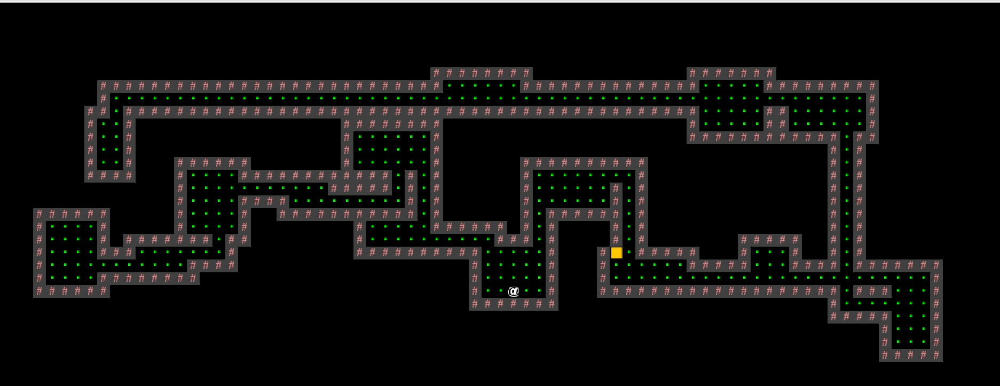

# 2D Tile-Based Game

Welcome to the 2D Tile-Based Game project! This is a Java-based game that lets you explore a dynamically generated 2D world using tile-based mechanics. Enter a seed, generate the world, and enjoy playing.

## Features

- Generation of a 2D tile-based world using a provided seed.
- Randomly generated terrain, providing unique gameplay experiences.
- Tile-based movement system allowing four directions: up, down, left, and right.
- Simple and intuitive controls for seamless navigation.
- Option to quit and save the game state for future sessions.

## Getting Started

To start playing the 2D Tile-Based Game, follow these steps:

1. Run **Main.java**.
2. After pressing N for "new game", enter a seed to generate the world, then press "S".
3. Use the provided controls to navigate through the tile-based world. Once reach the golden door, you win.

## Controls

- **W**: Move up
- **A**: Move left
- **S**: Move down
- **D**: Move right

## Quit and Save

You can save and quit the game at any time by pressing **:Q**. This action will save your progress and allow you to continue from where you left off in future sessions.

